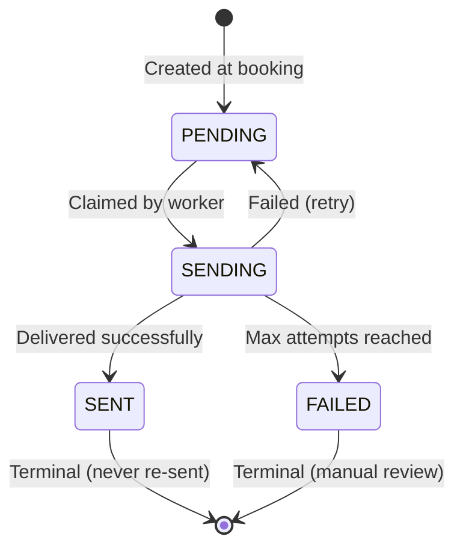

# Appointment Reminder Service

A Spring Boot service that books vehicle service appointments and sends automated reminders with **provable exactly-once delivery guarantees**.

## Problem

Book appointments and send reminders at T-24h and T-2h. **Critical requirement:** A customer must never receive the same reminder twice, and this must be provable from the data.

## Solution Architecture

```mermaid
flowchart TB
    Client([Client]) -->|POST /appointments| Controller[AppointmentController]
    Controller --> Service[AppointmentService]
    Service --> Planner[ReminderPlanner]
    
    Service -->|Single Transaction| DB[(PostgreSQL)]
    
    Scheduler[ReminderScheduler<br/>@Scheduled 15s] -->|Poll & Claim| Dispatch[ReminderDispatchService]
    Dispatch -->|FOR UPDATE<br/>SKIP LOCKED| DB
    Dispatch --> Sender[NotificationSender]
    
    DB -.->|appointment| Table1[appointment table]
    DB -.->|reminder| Table2[reminder table<br/>UNIQUE constraint<br/>status = PENDING/SENT]
```

## How Exactly-Once Works

The guarantee comes from two layers:

### 1. Database Constraint Prevents Duplicates

```sql
CREATE UNIQUE INDEX ON reminder (appointment_id, lead_time_seconds);
```

Even if the application tries to insert duplicate reminders, PostgreSQL rejects them.

### 2. Atomic Claim-and-Process

```sql
SELECT * FROM reminder 
WHERE status = 'PENDING' AND send_at <= NOW()
FOR UPDATE SKIP LOCKED;
```

- Each worker locks the rows it claims
- Other workers skip locked rows
- After successful send: `status = 'SENT'` (terminal)
- Query filters `WHERE status = 'PENDING'` → SENT rows never re-selected

### State Machine



## Data Model

**appointment**
```
id (PK) | public_id (UUID) | dealership_id | customer_name | customer_contact | scheduled_at | status
```

**reminder** (work queue + audit log)
```
id (PK) | appointment_id (FK) | lead_time_seconds | send_at | status | attempts | sent_at
UNIQUE (appointment_id, lead_time_seconds) ← De-duplication backbone
INDEX (send_at) WHERE status = 'PENDING' ← Fast polling
```

## Tech Stack

- Java 17, Spring Boot 3.3
- PostgreSQL 16 with Flyway
- JPA/Hibernate
- Testcontainers for integration tests

## Quick Start

### Prerequisites
- Java 17+
- Docker

### Run

```bash
# Start database
docker compose up -d

# Run application
./mvnw spring-boot:run
```

Application starts at `http://localhost:8080`

### Demo with Short Reminder Times

```bash
REMINDER_LEAD_TIMES=PT2M,PT30S ./mvnw spring-boot:run
```

Then book an appointment 3 minutes out to see reminders fire immediately.

## API

### Create Appointment

```bash
curl -X POST http://localhost:8080/appointments \
  -H 'Content-Type: application/json' \
  -d '{
    "dealershipId": "dealer-123",
    "customerName": "Jane Doe",
    "customerContact": "jane@example.com",
    "scheduledAt": "2026-10-05T15:00:00Z"
  }'
```

Response: `201 Created`
```json
{
  "id": "uuid",
  "status": "BOOKED",
  "reminders": [
    {"label": "T-24h", "status": "PENDING", "sendAt": "2026-10-04T15:00:00Z"},
    {"label": "T-2h", "status": "PENDING", "sendAt": "2026-10-05T13:00:00Z"}
  ]
}
```

### Get Appointment

```bash
curl http://localhost:8080/appointments/{id}
```

## Configuration

`application.yml`:
```yaml
reminder:
  lead-times: [PT24H, PT2H]        # When reminders fire
  poll-interval-ms: 15000           # Dispatcher poll frequency
  batch-size: 500                   # Reminders per poll
  max-attempts: 5                   # Retries before FAILED
```

Override with environment variables:
```bash
REMINDER_LEAD_TIMES=PT1H,PT30M ./mvnw spring-boot:run
```

## Testing

```bash
./mvnw test
```

**Test Coverage (15 tests, all passing):**
- `AppointmentApiIntegrationTest` – HTTP contract
- `ReminderIdempotencyIntegrationTest` – Exactly-once guarantees, concurrent dispatch
- `ReminderRetryIntegrationTest` – Failure handling
- `ReminderPlannerTest` – Edge cases (past appointments)

All tests use Testcontainers with real PostgreSQL.

## Design Decisions

### Materialized Reminders
Create reminder rows at booking time, not computed on-the-fly. This enables:
- Database-level UNIQUE constraint (strongest de-dupe)
- Durable audit trail
- Simple indexed queue poll

### FOR UPDATE SKIP LOCKED
Safe concurrent processing without coordination. Multiple app instances can run simultaneously - each claims different rows.

### Separate Claim & Delivery Transactions
- Claim batch: flip PENDING → SENDING in one transaction
- Deliver each: independent `REQUIRES_NEW` transaction
- One failure doesn't roll back entire batch

### Terminal SENT Status
Once marked SENT, the row is never selected again. The dispatcher query explicitly filters `WHERE status = 'PENDING'`.

## Failure Handling

| Scenario | Handling |
|----------|----------|
| Transient send failure | Return to PENDING, retry (up to max-attempts) |
| Permanent failure | Mark as FAILED after max-attempts |
| Worker crash mid-send | Recovery sweep returns SENDING → PENDING after timeout |
| Multiple app instances | FOR UPDATE SKIP LOCKED prevents double-claiming |
| Appointment already past | Reminder scheduled for NOW, fires on next poll |

## Scale

Current capacity: **50K appointments/day** (100K reminder rows/day)

- Partial index on `(send_at) WHERE status = 'PENDING'` keeps queries fast
- FOR UPDATE SKIP LOCKED enables horizontal scaling
- Add instances → automatic load distribution

**Next steps for higher scale:**
- Partition reminder table by dealership or time
- Move to message broker (SQS/Kafka) with delayed delivery

## Production Roadmap

If I had another week:
- Cancellation & reschedule endpoints
- Real SMS/Email adapters with provider idempotency keys
- Observability: Prometheus metrics, distributed tracing
- Dead-letter queue for FAILED reminders
- Time-zone-aware scheduling (respect quiet hours)

## Project Structure

```
src/main/java/com/mykaarma/reminder/
├── config/             # Configuration properties
├── domain/             # JPA entities (Appointment, Reminder)
├── repository/         # Data access with custom queries
├── service/            # Business logic (dispatch, planning, scheduling)
├── notification/       # Sender interface + logging stub
└── web/                # REST controllers + DTOs

src/main/resources/
└── db/migration/       # Flyway SQL migrations

src/test/java/          # Integration tests with Testcontainers
```

## Questions & Assumptions

1. **Contact channel?** Kept `customerContact` as free text (email or phone). Stub sender is channel-agnostic.

2. **Time zones?** All times in UTC. Production would need dealership/customer time zones for quiet-hours rules.

3. **Cancellations?** Modeled with `AppointmentStatus.CANCELLED` but no endpoint yet. Dispatcher would skip reminders for cancelled appointments.

4. **Delivery semantics?** Current: at-least-once (rare duplicate on crash between "provider ACK" and "DB mark SENT"). Add provider idempotency key for strict exactly-once.

5. **Retention?** How long to keep SENT/FAILED rows before archiving?

---

Built by Harshit Kumar as a take-home assignment demonstrating production-quality Spring Boot architecture with provable correctness guarantees.
