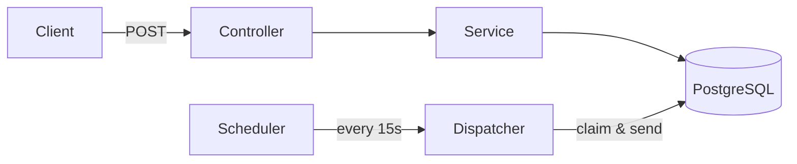
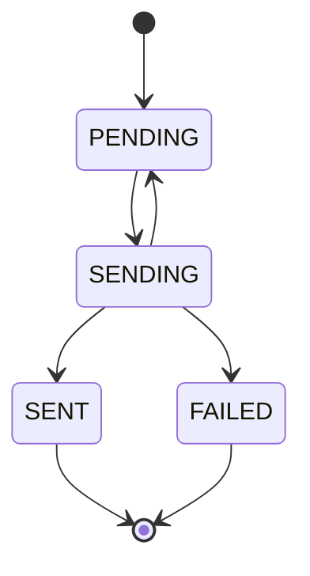

# Appointment Reminder Service

Vehicle service appointment booking with **provably exactly-once reminder delivery**.

## The Problem

Send reminders at T-24h and T-2h. Customer never gets duplicate reminders. Prove it.

## The Solution

Two-layer guarantee enforced by PostgreSQL:



**Layer 1: UNIQUE Constraint**
```sql
UNIQUE (appointment_id, lead_time_seconds)
```
Database rejects duplicate reminder rows.

**Layer 2: Atomic Claim**
```sql
SELECT ... WHERE status = 'PENDING' 
FOR UPDATE SKIP LOCKED
```
One worker claims, others skip. After send: `status = 'SENT'` (terminal).

## Quick Start

```bash
docker compose up -d
./mvnw spring-boot:run
```

**Demo mode (2min reminders):**
```bash
REMINDER_LEAD_TIMES=PT2M,PT30S ./mvnw spring-boot:run
```

## API Example

```bash
curl -X POST http://localhost:8080/appointments \
  -H 'Content-Type: application/json' \
  -d '{
    "dealershipId": "dealer-123",
    "customerName": "Jane Doe",
    "customerContact": "jane@example.com",
    "scheduledAt": "2026-10-05T15:00:00Z"
  }'
```

**Returns:**
```json
{
  "id": "uuid",
  "reminders": [
    {"label": "T-24h", "status": "PENDING"},
    {"label": "T-2h", "status": "PENDING"}
  ]
}
```

## Data Model

```
appointment: id | public_id | dealership_id | customer_name | scheduled_at | status
reminder:    id | appointment_id | lead_time_seconds | send_at | status | sent_at
             UNIQUE (appointment_id, lead_time_seconds) ← The guarantee
```

## How It Works

**Booking:** Single transaction creates appointment + 2 reminder rows.

**Dispatch:** Scheduler polls every 15s. Claims due reminders with `FOR UPDATE SKIP LOCKED`. Sends. Marks `SENT`.

**States:** `PENDING → SENDING → SENT` (or `FAILED` after retries)

**Proof:** Query `reminder` table. Each appointment has exactly 2 rows. Each row has exactly one `sent_at` timestamp.

## Why It Never Duplicates



**Query filters `WHERE status = 'PENDING'`**

Once `SENT`, never re-selected. Database-enforced, not app logic.

## Tech Stack

Java 17 • Spring Boot 3.3 • PostgreSQL 16 • Flyway • Testcontainers

## Tests

```bash
./mvnw test  # 15 tests, all pass
```

**Coverage:**
- `AppointmentApiIntegrationTest` – HTTP contract
- `ReminderIdempotencyIntegrationTest` – Exactly-once under concurrent load (8 threads)
- `ReminderRetryIntegrationTest` – Failure handling
- `ReminderPlannerTest` – Edge cases

All tests use Testcontainers with real PostgreSQL.

## Design Decisions

**Materialized reminders** – Create rows at booking, not computed on-the-fly. Enables UNIQUE constraint.

**FOR UPDATE SKIP LOCKED** – Safe concurrent processing. Multiple instances = automatic load distribution.

**Separate claim/delivery transactions** – One failure doesn't roll back entire batch.

## Scale

Current: 50K appointments/day (100K reminders/day)

Scaling: Add instances. Partial index on `(send_at) WHERE status = 'PENDING'` keeps queries fast.

Next: Partition by dealership. Move to message broker (SQS/Kafka) for 1M+/day.

## Production Gaps

What's missing for production:
- Cancellation/reschedule endpoints
- Real SMS/email adapters with provider idempotency keys
- Metrics (Prometheus) + tracing (Jaeger)
- Time-zone aware scheduling

## Project Structure

```
src/main/java/com/mykaarma/reminder/
├── config/          Configuration
├── domain/          JPA entities
├── repository/      Data access (includes FOR UPDATE SKIP LOCKED query)
├── service/         Business logic
├── notification/    Sender interface + stub
└── web/             REST API

src/main/resources/db/migration/  Flyway SQL
src/test/java/                    Integration tests
```

## Key Files

- `ReminderDispatchService.java` – The claim-check pattern
- `ReminderRepository.java` – Contains the `FOR UPDATE SKIP LOCKED` query
- `V1__init.sql` – Database schema with UNIQUE constraint
- `ReminderIdempotencyIntegrationTest.java` – Proof of exactly-once

---

**Stack:** Java 17 • Spring Boot • PostgreSQL  
**Pattern:** Transactional outbox with materialized work queue  
**Guarantee:** Database-enforced exactly-once delivery
