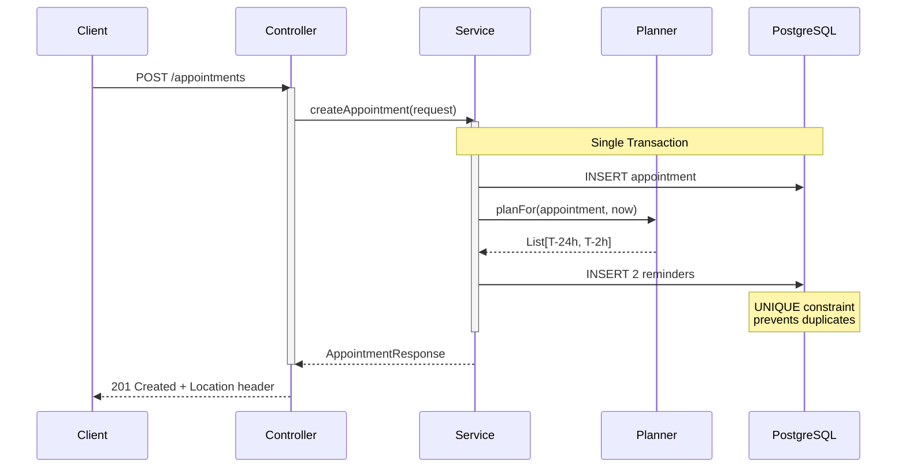
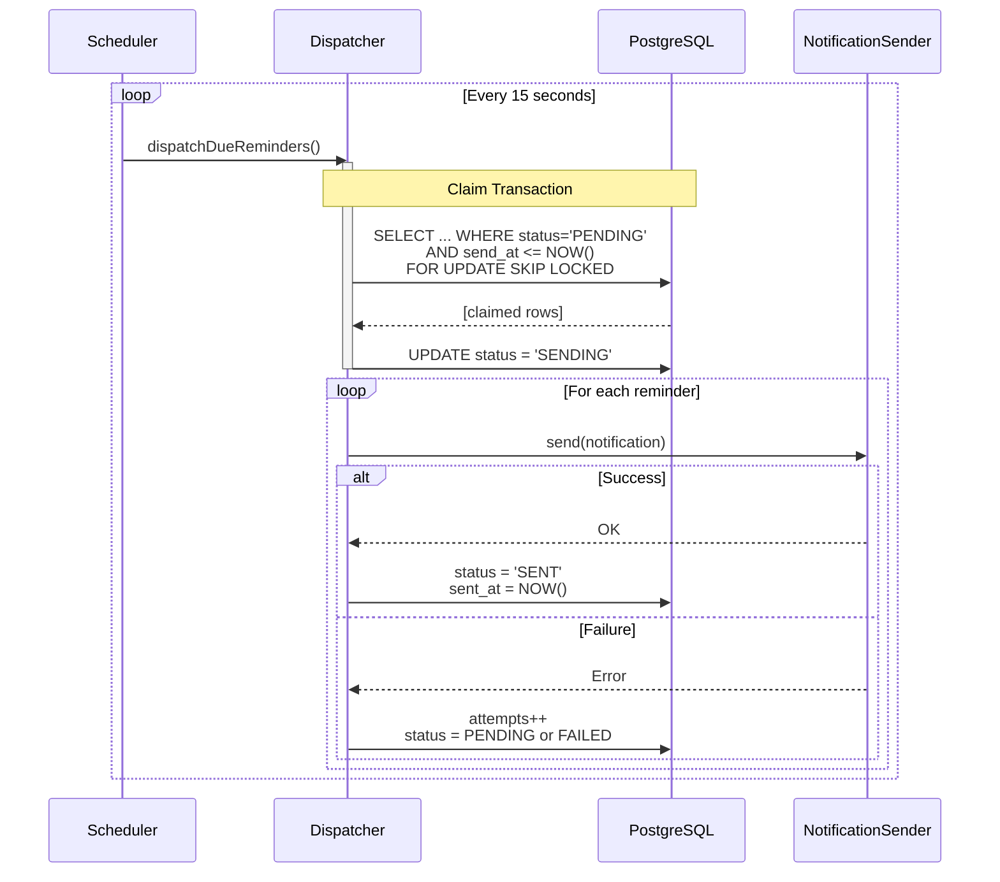
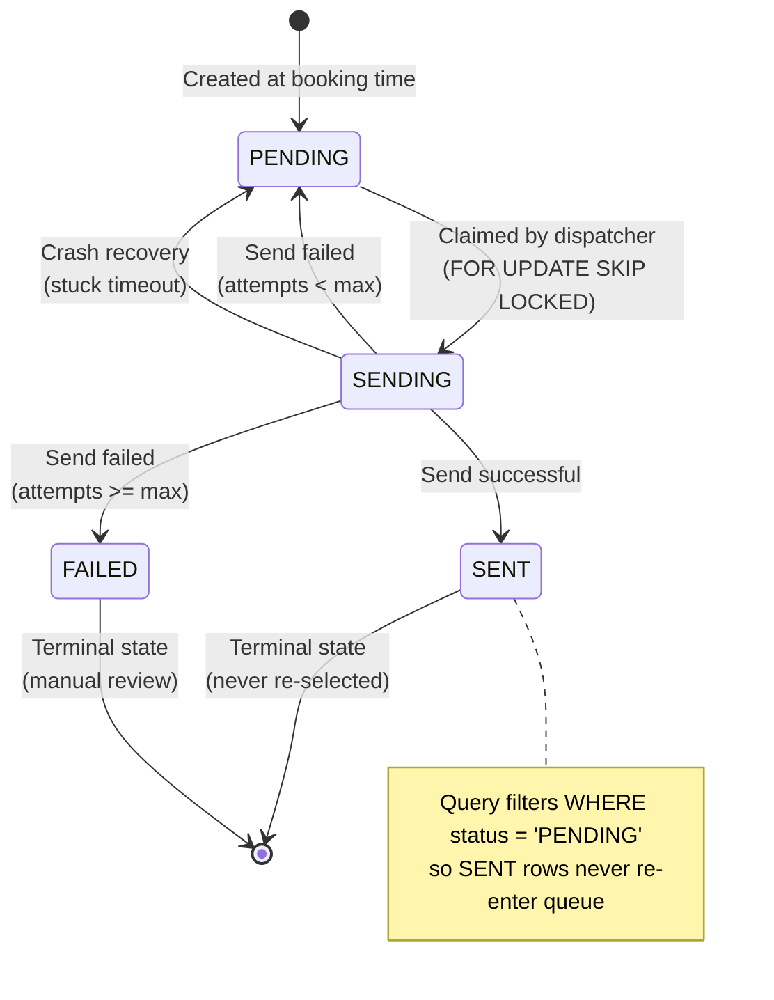

# Design Documentation

## System Overview

```mermaid
flowchart TB
    subgraph Client Layer
        HTTP[HTTP Client<br/>curl/Postman]
    end
    
    subgraph Application Layer
        Controller[AppointmentController<br/>POST /appointments<br/>GET /appointments/:id]
        Service[AppointmentService<br/>Transactional orchestration]
        Planner[ReminderPlanner<br/>Materializes T-24h, T-2h reminders]
        Scheduler[ReminderScheduler<br/>@Scheduled every 15s]
        Dispatch[ReminderDispatchService<br/>Claim-check pattern]
        Sender[NotificationSender<br/>Logging stub]
    end
    
    subgraph Data Layer
        DB[(PostgreSQL 16)]
        Appt[appointment table]
        Rem[reminder table<br/>UNIQUE constraint<br/>Partial index]
    end
    
    HTTP -->|POST| Controller
    HTTP -->|GET| Controller
    Controller --> Service
    Service --> Planner
    Service -->|Transaction| DB
    DB -.-> Appt
    DB -.-> Rem
    
    Scheduler -->|Poll| Dispatch
    Dispatch -->|SELECT FOR UPDATE<br/>SKIP LOCKED| Rem
    Dispatch -->|Send| Sender
    Dispatch -->|Update status| Rem
```

## Booking Flow



## Dispatch Flow (Exactly-Once Guarantee)



## State Machine



## Database Schema

### appointment

```sql
CREATE TABLE appointment (
    id BIGSERIAL PRIMARY KEY,
    public_id UUID NOT NULL UNIQUE,
    dealership_id VARCHAR(255) NOT NULL,
    customer_name VARCHAR(255) NOT NULL,
    customer_contact VARCHAR(255) NOT NULL,
    scheduled_at TIMESTAMP NOT NULL,
    status VARCHAR(50) NOT NULL,
    created_at TIMESTAMP NOT NULL DEFAULT NOW(),
    updated_at TIMESTAMP NOT NULL DEFAULT NOW()
);

CREATE INDEX idx_appointment_dealership ON appointment(dealership_id);
CREATE INDEX idx_appointment_scheduled ON appointment(scheduled_at);
```

### reminder

```sql
CREATE TABLE reminder (
    id BIGSERIAL PRIMARY KEY,
    appointment_id BIGINT NOT NULL REFERENCES appointment(id),
    lead_time_seconds INTEGER NOT NULL,
    send_at TIMESTAMP NOT NULL,
    status VARCHAR(50) NOT NULL DEFAULT 'PENDING',
    attempts INTEGER NOT NULL DEFAULT 0,
    sent_at TIMESTAMP,
    error_message TEXT,
    created_at TIMESTAMP NOT NULL DEFAULT NOW(),
    updated_at TIMESTAMP NOT NULL DEFAULT NOW(),
    
    -- De-duplication constraint
    CONSTRAINT reminder_appointment_lead_time_key 
        UNIQUE (appointment_id, lead_time_seconds)
);

-- Fast queue polling
CREATE INDEX idx_reminder_due 
    ON reminder(send_at) 
    WHERE status = 'PENDING';

-- Monitoring
CREATE INDEX idx_reminder_status ON reminder(status);
```

## Concurrency Model

### Problem: Multiple Instances Processing Same Queue

```
Instance A           Queue              Instance B
    |                 [R1]                  |
    |                 [R2]                  |
    |                 [R3]                  |
    |                                       |
    +--> SELECT R1,R2 ----------------> SELECT R1,R2
         FOR UPDATE                     (blocks on R1,R2)
    |                                       |
    +--> UPDATE R1,R2                       |
         status=SENDING                     |
    |                                       |
    +--> COMMIT                             |
    |                                       |
    |                                  (unblocked, but R1,R2
    |                                   no longer PENDING)
    |                                       |
    |                                  SELECT finds R3 only
    |                                       |
```

### Solution: SKIP LOCKED

```
Instance A           Queue              Instance B
    |                 [R1]                  |
    |                 [R2]                  |
    |                 [R3]                  |
    |                                       |
    +--> SELECT R1,R2 ----------------> SELECT R3
         FOR UPDATE                     FOR UPDATE
         SKIP LOCKED                    SKIP LOCKED
    |                                       |
    +--> Process R1,R2            Process R3 <--+
    |                                       |
```

No blocking, no duplicates, automatic load distribution.

## Edge Cases

### Appointment Booked Inside Reminder Window

```
Current time: 10:00
Appointment:  10:30

T-24h reminder would be: 09:30 (already past!)
T-2h reminder would be:  08:30 (already past!)
```

**Handling:** Schedule for NOW instead of negative time
```java
sendAt = max(scheduledAt - leadTime, now)
```

Reminders fire on next poll cycle.

### Worker Crash Mid-Delivery

```
1. Worker claims reminder (status = SENDING)
2. Worker calls notification provider
3. Worker crashes before marking SENT
```

**Recovery:** Background sweep finds SENDING rows older than threshold, returns to PENDING
```sql
UPDATE reminder 
SET status = 'PENDING', attempts = attempts + 1
WHERE status = 'SENDING' 
  AND updated_at < NOW() - INTERVAL '5 minutes';
```

### Transient Send Failure

```
1. Claim reminder (SENDING)
2. Network timeout calling provider
3. Increment attempts
4. Return to PENDING (if attempts < max)
5. Next poll cycle retries
```

After `max-attempts`, mark as FAILED (manual review queue).

## Why This Design

### Materialized Reminders (Not Computed)

**Alternative:** Query appointments where `scheduled_at - NOW() IN (24h, 2h)`

**Problems:**
- Complex query with no guarantee of exactly-once
- Can't enforce UNIQUE constraint
- No audit trail

**Our approach:** Create rows upfront
- UNIQUE constraint is database-enforced
- Simple queue poll: `SELECT WHERE status='PENDING' AND send_at <= NOW()`
- Built-in audit trail (reminder table IS the log)

### FOR UPDATE SKIP LOCKED (Not Broker)

**Alternative:** SQS/Kafka for work distribution

**Trade-off:**
- ✅ Simpler: no external infrastructure
- ✅ Transactional: claims are DB transactions
- ✅ Good enough: handles 50K/day easily
- ❌ Not ideal for 1M+/day scale

**Future:** Move to broker when load increases

### Separate Claim & Delivery

**Alternative:** Claim and send in same transaction

**Problem:** One failure rolls back entire batch

**Our approach:**
- Transaction 1: Claim batch (PENDING → SENDING)
- Transaction 2-N: Deliver each (independent `REQUIRES_NEW`)

One failure affects only that reminder.

## Performance Characteristics

### Write Path (Booking)
- 1 appointment INSERT
- 2 reminder INSERTs
- Total: ~5ms (single transaction)

### Read Path (Dispatch)
- Partial index scan on `(send_at) WHERE status='PENDING'`
- Row locks via FOR UPDATE SKIP LOCKED
- Batch size: 500 reminders/poll
- Poll interval: 15 seconds
- Throughput: ~2000 reminders/minute per instance

### Scaling
- Horizontal: Add instances (automatic load distribution)
- Vertical: Increase batch size, decrease poll interval
- Database: Partition reminder table by time or dealership

## Monitoring Metrics

**Suggested:**
- `reminders.sent.total` – Counter of successful sends
- `reminders.failed.total` – Counter of failures
- `reminders.dispatch.latency` – How long after due time
- `reminders.queue.depth` – Count of PENDING reminders
- `reminders.status.gauge{status}` – Current counts by status

**Alerts:**
- Queue depth > 10000
- Failed count increasing
- Average dispatch latency > 1 minute

## Testing Strategy

### Unit Tests
- `ReminderPlannerTest` – Pure logic, no dependencies

### Integration Tests (Testcontainers)
- Real PostgreSQL instance per test class
- `AppointmentApiIntegrationTest` – HTTP contract
- `ReminderIdempotencyIntegrationTest` – Core guarantees
  - DB rejects duplicate inserts
  - Concurrent dispatch sends each reminder exactly once
  - 8 threads hammering dispatcher simultaneously
- `ReminderRetryIntegrationTest` – Failure scenarios

---

This design prioritizes **correctness** (provable guarantees) over **performance** (good enough for stated scale). For higher load, the architecture naturally evolves to message brokers while keeping the same guarantees.
