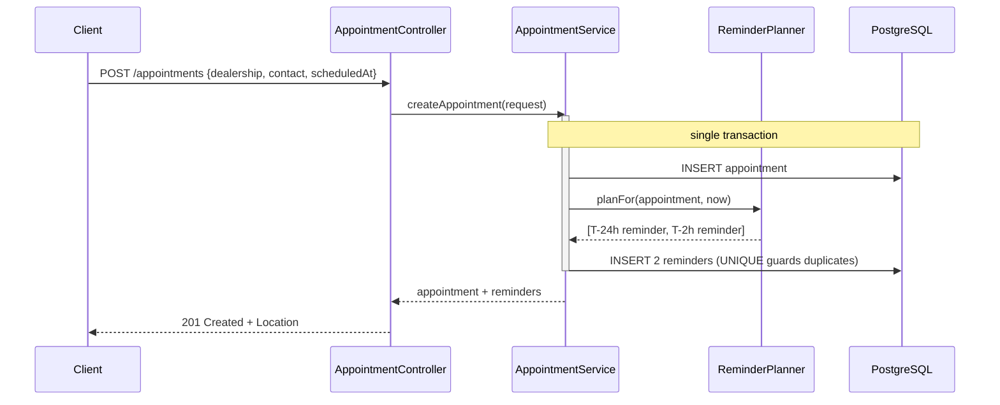
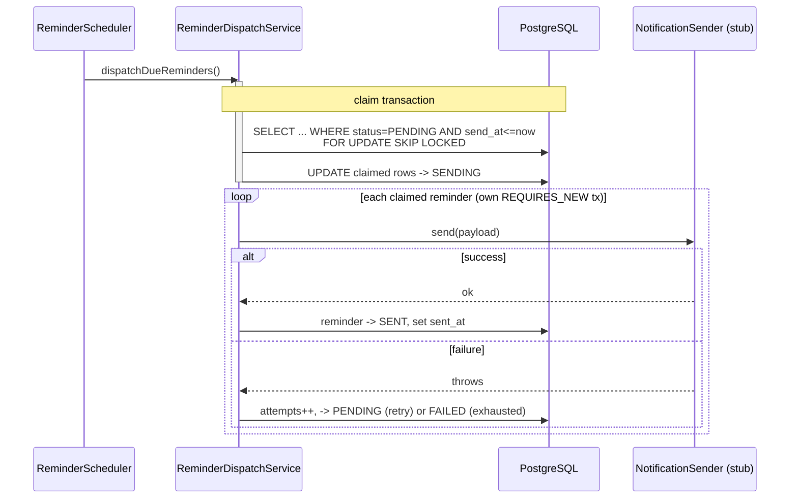
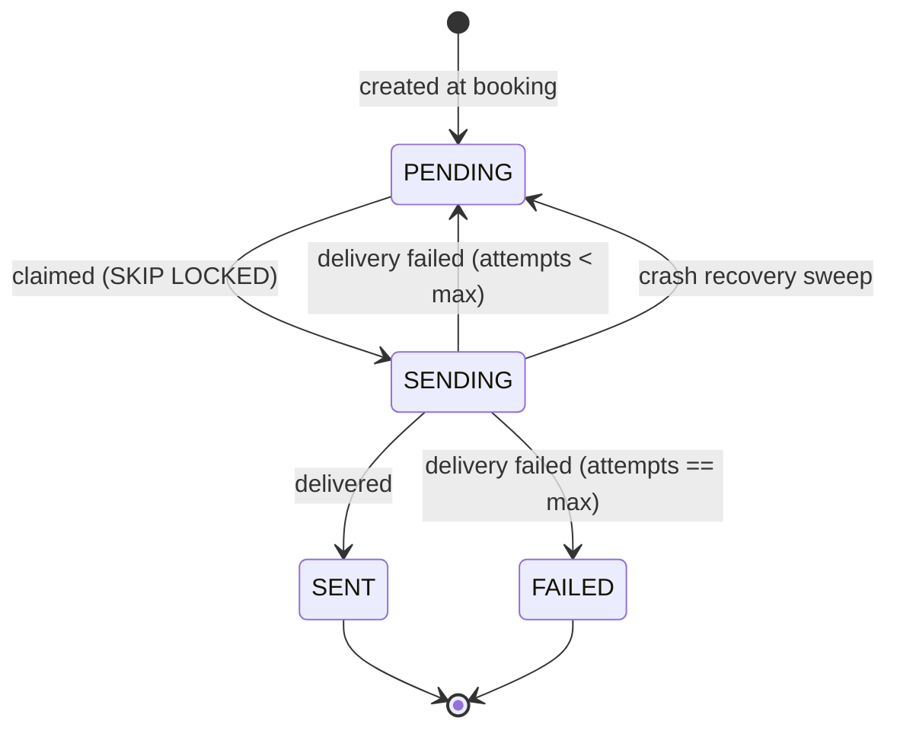

# Design diagram

## Component / sequence overview

```mermaid
flowchart TB
    client([Client])

    subgraph svc[appointment-reminder-service]
        controller[AppointmentController]
        apptSvc[AppointmentService]
        planner[ReminderPlanner]
        scheduler[ReminderScheduler @Scheduled]
        dispatch[ReminderDispatchService]
        sender[NotificationSender - stub logs payload]
    end

    subgraph db[(PostgreSQL)]
        appt[[appointment]]
        rem[["reminder\nUNIQUE(appointment_id, lead_time_seconds)\npartial index on send_at WHERE status=PENDING"]]
    end

    client -- "POST /appointments" --> controller
    controller --> apptSvc
    apptSvc --> planner
    apptSvc -- "one transaction:\nappointment + 2 reminders" --> appt
    apptSvc --> rem
    client -- "GET /appointments/{id}" --> controller

    scheduler -- "every poll-interval" --> dispatch
    dispatch -- "claim due: FOR UPDATE SKIP LOCKED\nPENDING -> SENDING" --> rem
    dispatch -- "deliver (REQUIRES_NEW)" --> sender
    dispatch -- "mark SENT / record failure" --> rem
```

## Booking sequence



## Dispatch sequence (the exactly-once path)



## Reminder state machine



`SENT` is terminal and is what makes "never sent twice" provable: the dispatch
query only ever selects `PENDING` rows, so a `SENT` reminder is never reconsidered.
